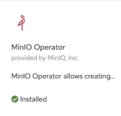
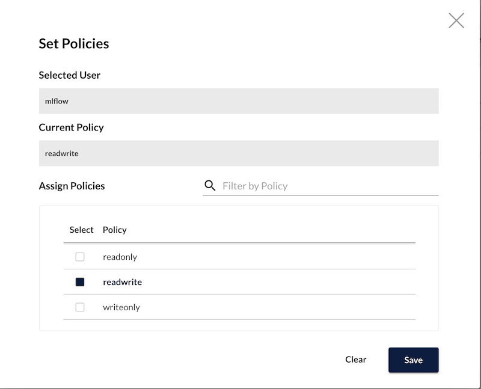

= Introduction

In this example, we will demostrate using https://mlflow.org/[MLflow] with https://github.com/minio/operator[Minio]. 

== Prerequisite

This requires Minio running to serve as a S3 backend for MLflow.

Install the Minio Operator from OpenShift Operator Hub. This will install the operator into the `openshift-operators` namespace. 

Once the Operator is installed, create a Minio `Tenant`. This will create minio in the `minio` namespace.

The console and S3 routes will be created. Default user credentials can be found in the yaml file.

[source, bash]
----
$ oc create -f minio/minio.yaml
----

Using the minio console, create a `mlflow` bucket with a user account.

The user account should have the default access and secret key(`mlflow/tT8FqTVT3EP8Fmgv`) and assigned with the `readwrite` policy.

== Deploying MLflow

[source, bash]
----
$ oc create -f mlflow/mlflow.yaml
----

MLflow route is protected by Basic Authentication. The default username/password is `mlflow/czZ7BmL7eKqsTcCm`

== Running a sample Elasticnet model 

Under `samples`, modify `MLFLOW_S3_ENDPOINT_URL` and `MLFLOW_TRACKING_URI` to the right values before running the `wine-quality.sh` bash script.

[source, bash]
----
export MLFLOW_S3_ENDPOINT_URL=https://s3-minio.apps.cluster-435b.435b.sandbox766.opentlc.com
export MLFLOW_TRACKING_URI=https://mlflow-mlflow.apps.cluster-435b.435b.sandbox766.opentlc.com
export AWS_ACCESS_KEY_ID=mlflow
export AWS_SECRET_ACCESS_KEY=tT8FqTVT3EP8Fmgv
export MLFLOW_TRACKING_USERNAME=mlflow
export MLFLOW_TRACKING_PASSWORD=czZ7BmL7eKqsTcCm
----

The python dependencies can be installed using `pip`. 
[source, bash]
----
pip install -r samples/requirements.txt
----

== Changing default passwords

The following default passwords can be changed by updating the following files:

* `minio/minio.yaml`

Details of the credentials can be found https://github.com/minio/operator/blob/master/docs/crd.adoc[here].
[cols="1,1"]
|===
|`minio-creds-secret`
|Specifcy a Kubernetes opaque secret for the console

|`console-secret`
|Specify a Kubernetes opaque secret to use for setting the MinIO root access key and secret key.
|===

* `mlflow/mlfow.yaml`

[cols="1,1"]
|===
|`nginx-htpasswd`
|Nginx basic authentication username and password. Use htpasswd and base64 to encode the file. 

|`minio-secret`
|This is the credential for the mlflow s3 bucket
|===

* `samples/wine-quality.sh`

Update the file with correct credentials.